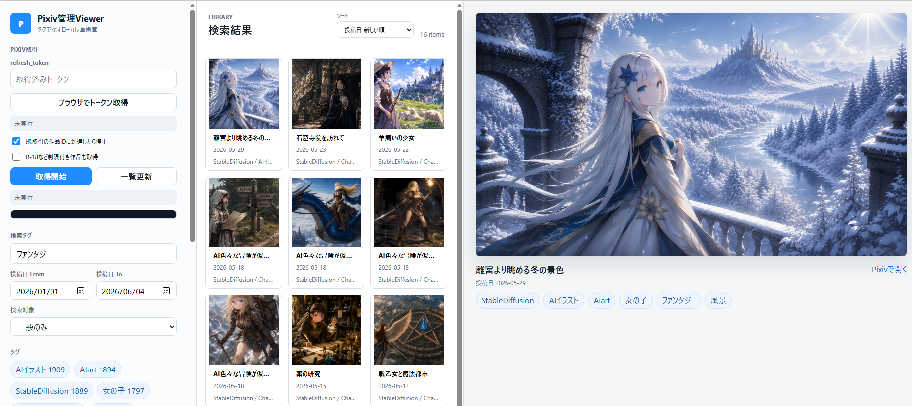

# Pixiv管理Viewer

Pixivに投稿した自分の作品をローカルへバックアップし、タグ・投稿日・R-18条件で検索できる画像ビューアーです。

本ツールは、自分がPixivへ投稿した作品のバックアップとローカル閲覧を目的としています。

## Screenshots



## 必要なもの

- Windows 11
- Python 3.11 以降
- PythonにPATHが通っていること

コマンドはPowerShellで実行する前提です。

## 初回セットアップ

PowerShellでプロジェクトフォルダへ移動し、同梱の `setup.bat` を実行してください。

```powershell
.\setup.bat
```

`setup.bat` は次の処理を実行します。

- プロジェクトフォルダ内にPython仮想環境 `.venv` を作成
- `requirements.txt` に記載されたPythonライブラリのインストール
- Pixivログイン用ブラウザとして使うPlaywright Chromiumのインストール

手動で実行する場合は、PowerShellで次を実行してください。

```powershell
python -m venv .venv
& .\.venv\Scripts\python.exe -m pip install -r requirements.txt
& .\.venv\Scripts\python.exe -m playwright install chromium
```

## 起動

通常は同梱のバッチを使います。

```powershell
.\start_viewer.bat
```

このバッチは `.venv` が存在する場合は `.venv` 内のPythonで `app.py --replace-existing` を実行します。既に8765番ポートで古いサーバーが動いている場合は停止してから起動します。

`setup.bat` 実行済みの場合、`start_viewer.bat` は `.venv` 内のPythonを使って起動します。`.venv` が存在しない場合は、PATH上の `python` を使います。

ブラウザで次を開きます。

```text
http://127.0.0.1:8765
```

停止する時は、起動したウィンドウで `Ctrl + C` を押してください。

`pixiv_viewer.db` が存在しない場合は、起動時または初回データ登録時に自動作成されます。git clone直後の状態でもそのまま起動できます。

## 同じLAN内のiPadから見る

PCとiPadを同じWi-Fiに接続してからサーバーを起動します。起動時に次のようなURLが表示されます。

```text
LAN/iPad URL: http://192.168.x.x:8765
```

iPadのSafariでそのURLを開きます。開けない場合は、Windows Defender FirewallでPythonまたはTCPポート `8765` の受信を許可してください。

PC自身だけで使いたい場合は、ローカル専用で起動できます。

```powershell
& .\.venv\Scripts\python.exe app.py --host 127.0.0.1 --replace-existing
```

## 使い方

画面左の「Pixiv取得」に `refresh_token` を入力して「取得開始」を押すと、画像取得とDB登録を実行します。

- 「既取得の作品IDに到達したら停止」: 新しい順に確認し、登録済み作品に到達したら終了
- 「R-18など制限付き作品も取得」: Pixiv APIから返ってきた制限付き作品も保存
- 検索タグ: スペース区切りで複数タグ検索
- 投稿日 From/To: Pixivの投稿日で絞り込み
- 検索対象: 一般のみ、R-18のみ、R-18を含む
- ソート: 投稿日順、作品名順

画像をクリック/タップすると拡大表示します。画像表示中は左右スワイプ、またはPCの左右キーで前後の画像へ移動できます。

## トークン取得

メイン画面の「ブラウザでトークン取得」ボタンから取得できます。ブラウザでPixivにログインすると、取得した `refresh_token` が入力欄へセットされます。

コマンドラインで取得したい場合は次を使います。

```powershell
python tools/get_pixiv_token_browser.py
```

## コマンドライン取得

画面を使わずに、自分のログインユーザ作品を取得する場合:

```powershell
$env:PIXIV_REFRESH_TOKEN="your_refresh_token"
python tools/download_my_pixiv.py
```

2回目以降を速く終わらせたい場合:

```powershell
python tools/download_my_pixiv.py --stop-at-existing
```

R-18など制限付き作品も含める場合:

```powershell
python tools/download_my_pixiv.py --include-restricted
```

既存画像に投稿日やR-18判定を補完したい場合は、画像本体は再ダウンロードされないので、いったん `--stop-at-existing` なしで再実行してください。

## ローカル画像を登録する

画像を `library/images` に置いてから、次を実行します。

```powershell
python tools/import_local_images.py library/images
```

同じフォルダに `画像ファイル名.json` がある場合、メタ情報を読み込みます。

```json
{
  "title": "sample",
  "tags": ["背景", "青空", "創作"],
  "pixiv_id": "12345678",
  "source_url": "https://www.pixiv.net/artworks/12345678",
  "posted_at": "2026-01-01T12:00:00+09:00",
  "restrict_level": 0
}
```

## データ保存場所

未設定の場合、DBはプロジェクト直下の `pixiv_viewer.db`、画像ファイルとPixiv取得時のJSONメタ情報は `library/images/` に保存されます。

保存場所は `local_config.json` または環境変数で変更できます。`local_config.json` はGit管理対象外です。設定例は [local_config.example.json](local_config.example.json) を参照してください。

```json
{
  "db_path": "D:/PixivViewerData/pixiv_viewer.db",
  "image_dir": "D:/PixivViewerData/images",
  "thumb_dir": "D:/PixivViewerData/thumbs",
  "storage_layout": "flat"
}
```

相対パスを指定した場合は、プロジェクトフォルダからの相対パスとして扱います。絶対パスを指定した場合は、その場所を直接参照します。

環境変数で指定する場合:

```powershell
$env:PIXIV_VIEWER_DB_PATH="D:\PixivViewerData\pixiv_viewer.db"
$env:PIXIV_VIEWER_IMAGE_DIR="D:\PixivViewerData\images"
$env:PIXIV_VIEWER_THUMB_DIR="D:\PixivViewerData\thumbs"
.\start_viewer.bat
```

環境変数は `local_config.json` より優先されます。

一覧表示用のサムネイルは、未設定の場合 `library/thumbs/` に自動生成されます。必要に応じて `thumb_dir` または `PIXIV_VIEWER_THUMB_DIR` で変更できます。サムネイルが存在しない場合は、一覧表示時の初回アクセスで元画像から作成されます。

保存レイアウトは `storage_layout` または `PIXIV_VIEWER_STORAGE_LAYOUT` で変更できます。既定値は既存環境との互換性を優先して `flat` です。`by_user` を指定すると、Pixiv由来の画像とJSONは `library/images/users/{user_id}/`、サムネイルは `library/thumbs/users/{user_id}/` に保存されます。ローカルインポート画像は `library/images/local/` に保存されます。

既存ファイルを `by_user` へ移行する場合は、必ず先にdry-runで確認してください。

```powershell
python tools/migrate_storage_layout.py --to by_user --dry-run
python tools/migrate_storage_layout.py --to by_user --apply
```

`--apply` 実行時はDBバックアップと移行manifest JSONが作成されます。通常起動時に既存ファイルが自動移動されることはありません。

サムネイルをまとめて再生成する場合:

```powershell
& .\.venv\Scripts\python.exe tools/rebuild_thumbnails.py
```

DBはSQLiteのWALモードで動作します。実行中は `pixiv_viewer.db-wal` と `pixiv_viewer.db-shm` が作成される場合があります。DBをバックアップする場合は、アプリを停止してから `pixiv_viewer.db` と同名の `*.db-wal` / `*.db-shm` が存在すれば一緒にコピーしてください。

## Git管理対象外ファイル

次のファイルはローカル実行時に生成・保存されるため、Git管理対象外です。

- `pixiv_viewer.db`
- `pixiv_viewer.db-wal`
- `pixiv_viewer.db-shm`
- `library/images/`
- `library/thumbs/`
- `__pycache__/`
- `*.log`
- 一時ファイル、キャッシュファイル
- `.env`、`token.*`、`refresh_token.*` などトークン情報を含むファイル

clone直後に `pixiv_viewer.db` や画像ファイルが存在しないのは正常です。初回起動や画像取得、ローカル画像登録によって必要なデータが作成されます。

## 配布時に消すもの

別環境へコピーする場合は、次を削除してからコピーしてください。

- `library/images/` の中身
- `pixiv_viewer.db`
- `__pycache__/`
- `tools/__pycache__/`
- ログファイルやトークンを書いたメモ

## 注意事項

本ツールは、自分がPixivへ投稿した作品のバックアップ用途を想定しています。Pixivの利用規約、API仕様、各種権利関係を遵守して使用してください。

refresh_tokenやトークン情報を含むファイルは第三者へ共有しないでください。

## 改訂履歴

- dev: 画面表示の微修正

## License

MIT Licenseです。詳細は [LICENSE](LICENSE) を参照してください。
